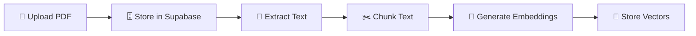
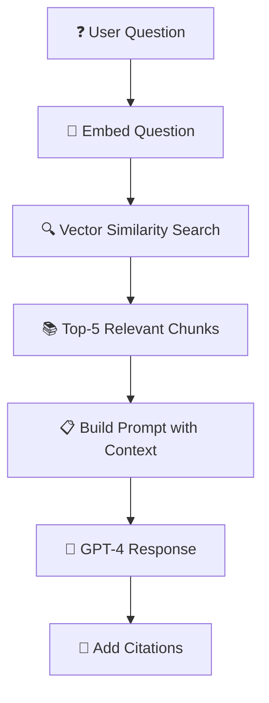
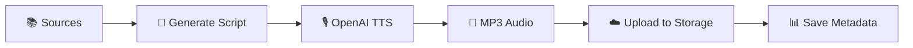
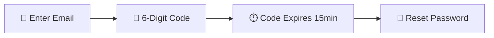
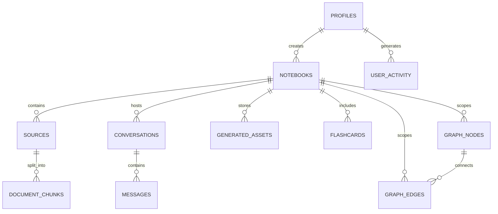

# 🧠 Memento - Technical Documentation

> **Harness Your Brilliance** — An AI-powered learning platform that transforms documents into interactive knowledge experiences.

---

## 📋 Table of Contents

1. [Product Overview](#product-overview)
2. [Architecture Overview](#architecture-overview)
3. [Technology Stack](#technology-stack)
4. [Feature Breakdown](#feature-breakdown)
   - [Document Processing Pipeline](#1-document-processing-pipeline)
   - [RAG Chat System](#2-rag-chat-system)
   - [Audio Overview Generation](#3-audio-overview-generation)
   - [Authentication System](#4-authentication-system)
   - [Notebook Management](#5-notebook-management)
   - [Studio Features](#6-studio-features)
5. [Database Schema](#database-schema)
6. [Storage Architecture](#storage-architecture)
7. [Security Implementation](#security-implementation)
8. [API Integrations](#api-integrations)
9. [Setup & Deployment](#setup--deployment)
10. [Cost Analysis](#cost-analysis)

---

# Product Overview

Memento is a hyperpersonalized learning application that transforms raw knowledge into deeply personalized, multimedia learning experiences. Inspired by Google's NotebookLM, it allows users to:

- **Upload** diverse data sources (PDFs, text files, audio, video, URLs)
- **Interact** with content through AI-powered chat with citations
- **Generate** multimedia outputs (podcasts, summaries, flashcards, quizzes)
- **Learn** through adaptive, personalized experiences

### Core Value Proposition

| Traditional Learning | Memento Learning |
|---------------------|------------------|
| Passive reading | Interactive AI chat |
| Generic summaries | Personalized explanations |
| Manual note-taking | Auto-generated flashcards |
| Static content | Dynamic audio/video generation |

---

# Architecture Overview

```
┌─────────────────────────────────────────────────────────────────┐
│                        FRONTEND (React + Vite)                 │
│  ┌──────────┐  ┌──────────┐  ┌──────────┐  ┌──────────┐       │
│  │Dashboard │  │ Notebook │  │  Studio  │  │   Chat   │       │
│  └────┬─────┘  └────┬─────┘  └────┬─────┘  └────┬─────┘       │
└───────┼─────────────┼─────────────┼─────────────┼──────────────┘
        │             │             │             │
        └─────────────┴─────────────┴─────────────┘
                            │
                    ┌───────▼───────┐
                    │   Supabase    │
                    │  (PostgreSQL) │
                    └───────┬───────┘
                            │
        ┌───────────────────┼───────────────────┐
        │                   │                   │
   ┌────▼────┐        ┌─────▼─────┐      ┌─────▼─────┐
   │   Auth  │        │  Storage  │      │ pgvector  │
   │  System │        │  Buckets  │      │ Embeddings│
   └─────────┘        └───────────┘      └───────────┘
                            │
                    ┌───────▼───────┐
                    │   OpenAI API  │
                    │ GPT-4 • TTS   │
                    │  Embeddings   │
                    └───────────────┘
```

---

# Technology Stack

## Frontend

| Technology | Version | Purpose |
|-----------|---------|---------|
| **React** | 19.2.0 | UI Framework |
| **TypeScript** | 5.8.2 | Type Safety |
| **Vite** | 6.2.0 | Build Tool |
| **TailwindCSS** | Latest | Styling |
| **React Router** | 7.9.6 | Navigation |
| **React Hook Form** | Latest | Form Management |
| **Zod** | 3.23.8 | Schema Validation |
| **Lucide React** | Latest | Icons |

## Backend & Database

| Technology | Purpose |
|-----------|---------|
| **Supabase** | Backend-as-a-Service (PostgreSQL + Auth + Storage) |
| **pgvector** | Vector similarity search for RAG |
| **Row Level Security** | Database-level access control |

## AI/ML Integrations

| Provider | Model | Purpose |
|----------|-------|---------|
| **OpenAI** | GPT-4/GPT-4 Turbo | Chat responses, script generation |
| **OpenAI** | text-embedding-3-small | Document embeddings (1536 dimensions) |
| **OpenAI** | TTS (tts-1-hd) | Audio narration |
| **OpenAI** | Whisper | Audio transcription |

## File Processing

| Library | Purpose |
|---------|---------|
| **pdfjs-dist** | PDF text extraction |
| **Web3Forms** | Email service for password reset |

---

# Feature Breakdown

## 1. Document Processing Pipeline

### Overview
The document processing pipeline transforms uploaded files into searchable, AI-queryable content.

### Implementation Files
- `lib/documentProcessor.ts` — Main processing logic
- `lib/pdfProcessor.ts` — PDF-specific extraction
- `pages/NewNotebookSetup.tsx` — Upload UI

### Processing Flow



### Technical Details

| Step | Implementation |
|------|---------------|
| **Text Extraction** | PDF.js parses each page, extracting raw text |
| **Chunking** | 1000 characters per chunk, 200 character overlap |
| **Embeddings** | OpenAI `text-embedding-3-small` (1536 dimensions) |
| **Storage** | PostgreSQL with pgvector extension |

### Code Flow
```typescript
// Simplified flow from documentProcessor.ts
1. uploadAndProcessDocument(file, notebookId)
2. extractTextFromPDF(file)        // Returns text array per page
3. chunkText(fullText)             // Splits into overlapping chunks
4. generateEmbeddings(chunks)      // Calls OpenAI API
5. storeChunks(chunks, embeddings) // Inserts to document_chunks table
```

---

## 2. RAG Chat System

### Overview
Retrieval-Augmented Generation (RAG) enables AI to answer questions using context from uploaded documents.

### Implementation Files
- `lib/aiChat.ts` — RAG logic
- `components/ChatInterface.tsx` — Chat UI
- `supabase/match_document_chunks.sql` — Vector search function

### How RAG Works



### Vector Search Function
```sql
-- match_document_chunks.sql
CREATE FUNCTION match_document_chunks(
  query_embedding vector(1536),
  match_threshold float,
  match_count int,
  p_notebook_id uuid
)
RETURNS TABLE (
  id uuid,
  content text,
  metadata jsonb,
  similarity float
)
```

### Chat Features
- ✅ Context-aware responses from uploaded documents
- ✅ Citation linking to source documents
- ✅ Conversation history persistence
- ✅ Real-time streaming responses

---

## 3. Audio Overview Generation

### Overview
Generate NotebookLM-style podcast summaries from document content.

### Implementation Files
- `lib/audioGenerator.ts` — Generation logic
- `components/AudioOverviewModal.tsx` — Generation UI

### Audio Generation Formats

| Format | Description |
|--------|-------------|
| **Deep Dive** | Comprehensive exploration of topic |
| **Critical Analysis** | Critical examination of sources |
| **Debate** | Two perspectives discussing the topic |
| **Overview** | High-level summary |

### Duration Options
- 10 minutes (~1,500 words)
- 30 minutes (~4,500 words)
- 1 hour (~9,000 words)
- 3 hours (~27,000 words)

### Generation Pipeline



### Technical Implementation
1. **Script Generation**: GPT-4 creates multi-speaker podcast script
2. **Text-to-Speech**: OpenAI TTS converts script to audio
3. **Storage**: MP3 uploaded to `assets` bucket
4. **Metadata**: Saved to `generated_assets` table

---

## 4. Authentication System

### Overview
Secure user authentication with email/password and OAuth providers.

### Implementation Files
- `components/auth/SignIn.tsx` — Login form
- `components/auth/SignUp.tsx` — Registration form
- `components/auth/ForgotPassword.tsx` — Password reset
- `lib/supabase/client.ts` — Supabase client

### Authentication Methods

| Method | Status | Implementation |
|--------|--------|---------------|
| Email/Password | ✅ Implemented | Supabase Auth |
| Google OAuth | ✅ Implemented | Supabase OAuth |
| Microsoft OAuth | 🔜 Planned | Azure AD |

### Password Reset Flow



### Security Features
- ✅ Bcrypt password hashing (via Supabase)
- ✅ JWT token management
- ✅ Protected route guards
- ✅ Session persistence

---

## 5. Notebook Management

### Overview
Notebooks organize documents and generated content by topic.

### Implementation Files
- `pages/Dashboard.tsx` — Notebook list
- `pages/Notebook.tsx` — Single notebook view
- `pages/Notebooks.tsx` — All notebooks grid

### Notebook Structure
```typescript
interface Notebook {
  id: string;
  user_id: string;
  title: string;
  description: string;
  icon: string;        // Emoji icon
  color: string;       // Tailwind color class
  is_public: boolean;  // Sharing flag
  created_at: Date;
}
```

### Features
- 📂 Create/delete notebooks
- 🎨 Custom icons and colors
- 📤 Multi-file upload support
- 🔗 Source management
- 🔐 Public/private visibility

---

## 6. Studio Features

### Overview
AI-powered content generation suite within each notebook.

### Implementation Files
- `components/StudioPanel.tsx` — Main studio UI
- Feature-specific modals in `components/`

### Available Features

| Feature | File | Status |
|---------|------|--------|
| **Audio Overview** | `AudioOverviewModal.tsx` | ✅ Implemented |
| **Flashcards** | `FlashcardsModal.tsx` | ✅ Implemented |
| **Quiz** | `QuizModal.tsx` | ✅ Implemented |
| **Mind Map** | `MindMapModal.tsx` | ✅ Implemented |
| **Report** | `ReportModal.tsx` | ✅ Implemented |
| **Video Overview** | `VideoOverviewModal.tsx` | 🔜 In Progress |
| **Handbook** | `HandbookModal.tsx` | 🔜 Planned |
| **Mentor Hour** | `MentorHourModal.tsx` | 🔜 Planned |

### Generator Libraries

| Generator | Purpose |
|-----------|---------|
| `flashcardGenerator.ts` | Create spaced-repetition flashcards |
| `quizGenerator.ts` | Generate adaptive quizzes |
| `mindmapGenerator.ts` | Build interactive mind maps |
| `reportGenerator.ts` | Create comprehensive reports |
| `slideGenerator.ts` | Generate presentation slides |
| `pdfGenerator.ts` | Export content as PDF |

---

# Database Schema

## Entity Relationship Diagram



## Core Tables

### profiles
Extends Supabase `auth.users` for user data.

| Column | Type | Description |
|--------|------|-------------|
| id | UUID (PK) | References auth.users.id |
| email | TEXT | User email |
| full_name | TEXT | Display name |
| avatar_url | TEXT | Profile picture URL |
| preferences | JSONB | User settings |

### notebooks
Central container for learning topics.

| Column | Type | Description |
|--------|------|-------------|
| id | UUID (PK) | Auto-generated |
| user_id | UUID (FK) | Owner reference |
| title | TEXT | Notebook name |
| description | TEXT | Description |
| icon | TEXT | Emoji icon |
| color | TEXT | Tailwind class |
| is_public | BOOLEAN | Sharing status |

### sources
Uploaded files and their metadata.

| Column | Type | Description |
|--------|------|-------------|
| id | UUID (PK) | Auto-generated |
| notebook_id | UUID (FK) | Parent notebook |
| title | TEXT | Source name |
| type | TEXT | pdf, text, url, youtube, mp3 |
| content | TEXT | Extracted text |
| processing_status | TEXT | pending, processing, completed, failed |

### document_chunks
Vector embeddings for RAG search.

| Column | Type | Description |
|--------|------|-------------|
| id | UUID (PK) | Auto-generated |
| source_id | UUID (FK) | Parent source |
| content | TEXT | Text chunk |
| embedding | VECTOR(1536) | OpenAI embedding |
| metadata | JSONB | Page numbers, etc. |

### generated_assets
AI-created content.

| Column | Type | Description |
|--------|------|-------------|
| id | UUID (PK) | Auto-generated |
| notebook_id | UUID (FK) | Parent notebook |
| type | TEXT | podcast, video, summary, handbook |
| title | TEXT | Asset name |
| media_url | TEXT | Storage path |
| transcript | TEXT | Full text content |

---

# Storage Architecture

## Supabase Storage Buckets

| Bucket | Visibility | Purpose |
|--------|------------|---------|
| `documents` | Private | User-uploaded files (PDFs, audio) |
| `assets` | Public | Generated media (podcasts, videos) |
| `avatars` | Public | User profile pictures |

## Storage Policies

### documents bucket (Private)
```sql
-- Users can only access their own notebook documents
CREATE POLICY "Users can upload to their notebooks"
ON storage.objects FOR INSERT
WITH CHECK (
  bucket_id = 'documents' AND
  (storage.foldername(name))[1] IN (
    SELECT id::text FROM notebooks WHERE user_id = auth.uid()
  )
);
```

---

# Security Implementation

## Row Level Security (RLS)

All database tables enforce RLS policies:

| Table | Policy |
|-------|--------|
| profiles | Users can only view/edit own profile |
| notebooks | Users can only access own notebooks |
| sources | Access via parent notebook ownership |
| document_chunks | Access via parent source ownership |
| conversations | Access via parent notebook ownership |
| messages | Access via parent conversation ownership |
| generated_assets | Access via parent notebook ownership |

## Security Measures

✅ **Database**: Row Level Security on all tables  
✅ **Storage**: Private buckets with signed URLs  
✅ **Auth**: JWT tokens with expiration  
✅ **API Keys**: Environment variables (never client-exposed)  
✅ **Passwords**: Bcrypt hashing via Supabase Auth  

---

# API Integrations

## OpenAI API

### Endpoints Used

| Endpoint | Model | Purpose |
|----------|-------|---------|
| `/v1/embeddings` | text-embedding-3-small | Document vectorization |
| `/v1/chat/completions` | gpt-4-turbo | Chat responses |
| `/v1/audio/speech` | tts-1-hd | Text-to-speech |
| `/v1/audio/transcriptions` | whisper-1 | Audio transcription |

### Rate Limits & Best Practices
- Implement exponential backoff for retries
- Batch embedding requests when possible
- Cache embeddings to avoid regeneration

## Web3Forms API

Used for sending password reset emails:
```typescript
// lib/email.ts
await fetch('https://api.web3forms.com/submit', {
  method: 'POST',
  body: { access_key, email, subject, message }
});
```

---

# Setup & Deployment

## Prerequisites
- Node.js 18+
- Supabase account
- OpenAI API key

## Quick Start

### 1. Install Dependencies
```bash
npm install
```

### 2. Environment Setup
Create `.env.local`:
```env
VITE_SUPABASE_URL=your-supabase-url
VITE_SUPABASE_ANON_KEY=your-supabase-anon-key
VITE_OPENAI_API_KEY=sk-your-openai-key
VITE_WEB3FORMS_KEY=your-web3forms-key
```

### 3. Database Setup
Run in Supabase SQL Editor:
1. `supabase/schema_safe.sql`
2. `supabase/match_document_chunks.sql`
3. `supabase/password_reset_codes_table.sql`

### 4. Storage Buckets
Create in Supabase Dashboard:
- `documents` (Private)
- `assets` (Public)
- `avatars` (Public)

### 5. Run Development Server
```bash
npm run dev
```
Open http://localhost:5173

---

# Cost Analysis

## OpenAI API Costs

| Service | Pricing | Example |
|---------|---------|---------|
| **Embeddings** | $0.020/1M tokens | 100-page PDF: ~$0.001 |
| **GPT-4 Turbo** | $0.01 input + $0.03 output/1K | Per chat: ~$0.01 |
| **TTS** | $15.00/1M characters | 10-min podcast: ~$0.15 |

## Typical Monthly Usage

| Activity | Estimated Cost |
|----------|---------------|
| 10 PDFs processed | $0.05 |
| 50 AI chat messages | $0.50 |
| 5 audio overviews | $0.75 |
| **Total** | **~$1.30/month** |

## Supabase Costs

| Tier | Limits |
|------|--------|
| **Free** | 500MB DB, 1GB storage, 50K MAU |
| **Pro** | $25/month for higher limits |

---

# Roadmap

## ✅ Completed
- PDF upload and processing
- AI chat with RAG
- Audio overview generation
- Vector search
- Authentication system
- Flashcard generation
- Quiz generation
- Mind map generation

## 🔜 Coming Soon
- LightRAG graph-based retrieval
- Multi-speaker TTS (Google Cloud)
- Video overview generation
- Handbook/summary exports
- Real-time collaboration
- Mobile app (React Native)

---

# Project Structure

```
memento/
├── components/           # React components
│   ├── auth/            # Authentication UI
│   ├── ui/              # Reusable UI elements
│   ├── ChatInterface.tsx
│   ├── AudioOverviewModal.tsx
│   ├── FlashcardsModal.tsx
│   ├── QuizModal.tsx
│   ├── MindMapModal.tsx
│   ├── StudioPanel.tsx
│   └── ...
├── lib/                 # Utilities and services
│   ├── supabase/        # Supabase client
│   ├── agents/          # AI agent logic
│   ├── documentProcessor.ts
│   ├── aiChat.ts
│   ├── audioGenerator.ts
│   ├── flashcardGenerator.ts
│   ├── quizGenerator.ts
│   └── ...
├── pages/              # Route pages
│   ├── Dashboard.tsx
│   ├── Notebook.tsx
│   ├── NewNotebookSetup.tsx
│   └── ...
├── supabase/           # Database SQL files
│   ├── schema_safe.sql
│   ├── match_document_chunks.sql
│   └── ...
└── documentation/      # Project docs
```

---

> **Made with 💜 by LunarTech AI**
