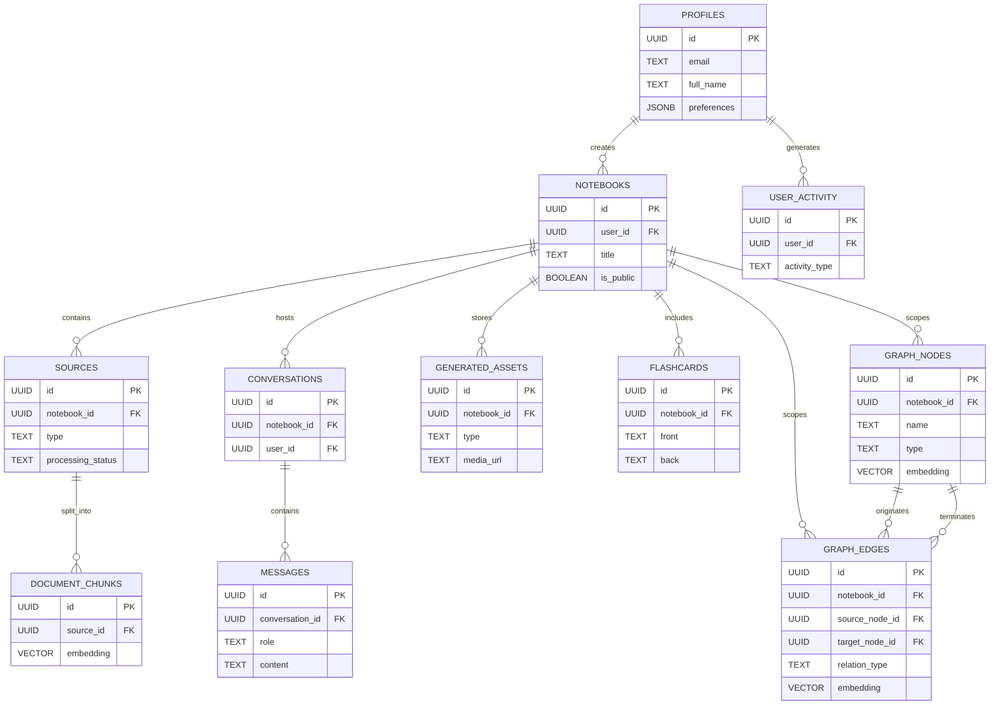

# Memento Database Schema

This document outlines the database schema for Memento, designed for Supabase (PostgreSQL). It supports the core features including user management, notebook organization, source processing, conversation history, and generated multimedia assets.

**Note on Storage:** We utilize **Supabase Storage** for all file persistence. It is S3-compatible, allowing for easy migration to AWS S3 if scaling requirements demand it in the future.

**Note on Retrieval:** Memento uses **LightRAG** (Graph-based Retrieval-Augmented Generation). This requires specific tables for storing knowledge graph entities (nodes) and relationships (edges) in addition to standard vector chunks. Each Notebook functions as an isolated Knowledge Graph instance.

## Core Entities

### 1. Users (`profiles`)
Extends the default Supabase `auth.users` table.
- **id**: `UUID` (Primary Key, References `auth.users.id`)
- **email**: `TEXT`
- **full_name**: `TEXT`
- **avatar_url**: `TEXT`
- **preferences**: `JSONB` (Stores user settings, learning goals, Luna integration data)
- **created_at**: `TIMESTAMPTZ` (Default: `now()`)

### 2. Notebooks (`notebooks`)
The central container for a learning topic. Acts as the boundary for a LightRAG Knowledge Graph instance.
- **id**: `UUID` (Primary Key, Default: `gen_random_uuid()`)
- **user_id**: `UUID` (Foreign Key `profiles.id`, ON DELETE CASCADE)
- **title**: `TEXT`
- **description**: `TEXT`
- **icon**: `TEXT` (Emoji or icon name)
- **color**: `TEXT` (Tailwind class or hex code)
- **is_public**: `BOOLEAN` (Default: `false`)
- **created_at**: `TIMESTAMPTZ` (Default: `now()`)
- **updated_at**: `TIMESTAMPTZ` (Default: `now()`)

### 3. Sources (`sources`)
Raw materials uploaded or linked by the user.
- **id**: `UUID` (Primary Key, Default: `gen_random_uuid()`)
- **notebook_id**: `UUID` (Foreign Key `notebooks.id`, ON DELETE CASCADE)
- **title**: `TEXT`
- **type**: `TEXT` (Enum: 'pdf', 'text', 'url', 'youtube', 'mp3')
- **content**: `TEXT` (Extracted raw text content)
- **file_path**: `TEXT` (Path in Supabase Storage `sources` bucket)
- **source_url**: `TEXT` (Original URL if applicable)
- **processing_status**: `TEXT` (Enum: 'pending', 'processing', 'completed', 'failed')
- **token_count**: `INTEGER`
- **created_at**: `TIMESTAMPTZ` (Default: `now()`)

### 4. Document Chunks (`document_chunks`)
Standard vector embeddings for hybrid retrieval.
- **id**: `UUID` (Primary Key, Default: `gen_random_uuid()`)
- **source_id**: `UUID` (Foreign Key `sources.id`, ON DELETE CASCADE)
- **content**: `TEXT` (The text chunk)
- **embedding**: `VECTOR(1536)` (OpenAI text-embedding-3-small)
- **metadata**: `JSONB` (Page numbers, timestamps, etc.)
- **created_at**: `TIMESTAMPTZ` (Default: `now()`)

### 5. Graph Nodes (`graph_nodes`)
Entities extracted for LightRAG. Scoped to a Notebook.
- **id**: `UUID` (Primary Key, Default: `gen_random_uuid()`)
- **notebook_id**: `UUID` (Foreign Key `notebooks.id`, ON DELETE CASCADE)
- **name**: `TEXT` (Name of the entity, e.g., "Quantum Mechanics")
- **type**: `TEXT` (Entity type, e.g., "Concept", "Person")
- **description**: `TEXT` (Summarized description of the entity)
- **embedding**: `VECTOR(1536)` (Embedding of the entity description)
- **created_at**: `TIMESTAMPTZ` (Default: `now()`)

### 6. Graph Edges (`graph_edges`)
Relationships between entities for LightRAG.
- **id**: `UUID` (Primary Key, Default: `gen_random_uuid()`)
- **notebook_id**: `UUID` (Foreign Key `notebooks.id`, ON DELETE CASCADE)
- **source_node_id**: `UUID` (Foreign Key `graph_nodes.id`, ON DELETE CASCADE)
- **target_node_id**: `UUID` (Foreign Key `graph_nodes.id`, ON DELETE CASCADE)
- **relation_type**: `TEXT` (e.g., "relates_to", "authored_by")
- **description**: `TEXT` (Description of the relationship)
- **embedding**: `VECTOR(1536)` (Embedding of the relationship description)
- **created_at**: `TIMESTAMPTZ` (Default: `now()`)

### 7. Conversations (`conversations`)
Chat sessions within a notebook.
- **id**: `UUID` (Primary Key, Default: `gen_random_uuid()`)
- **notebook_id**: `UUID` (Foreign Key `notebooks.id`, ON DELETE CASCADE)
- **user_id**: `UUID` (Foreign Key `profiles.id`, ON DELETE CASCADE)
- **title**: `TEXT`
- **created_at**: `TIMESTAMPTZ` (Default: `now()`)
- **updated_at**: `TIMESTAMPTZ` (Default: `now()`)

### 8. Messages (`messages`)
Individual messages in a conversation.
- **id**: `UUID` (Primary Key, Default: `gen_random_uuid()`)
- **conversation_id**: `UUID` (Foreign Key `conversations.id`, ON DELETE CASCADE)
- **role**: `TEXT` (Enum: 'user', 'assistant')
- **content**: `TEXT`
- **citations**: `JSONB` (Array of references to `document_chunks` or `graph_nodes` used)
- **created_at**: `TIMESTAMPTZ` (Default: `now()`)

### 9. Generated Assets (`generated_assets`)
AI-produced content like podcasts, videos, and summaries.
- **id**: `UUID` (Primary Key, Default: `gen_random_uuid()`)
- **notebook_id**: `UUID` (Foreign Key `notebooks.id`, ON DELETE CASCADE)
- **type**: `TEXT` (Enum: 'podcast', 'video', 'summary', 'documentary', 'handbook')
- **title**: `TEXT`
- **media_url**: `TEXT` (Path in Supabase Storage `assets` bucket)
- **transcript**: `TEXT`
- **duration_seconds**: `INTEGER`
- **created_at**: `TIMESTAMPTZ` (Default: `now()`)

### 10. Flashcards (`flashcards`)
Learning reinforcement items.
- **id**: `UUID` (Primary Key, Default: `gen_random_uuid()`)
- **notebook_id**: `UUID` (Foreign Key `notebooks.id`, ON DELETE CASCADE)
- **front**: `TEXT`
- **back**: `TEXT`
- **tags**: `TEXT[]`
- **next_review_at**: `TIMESTAMPTZ` (For spaced repetition)
- **created_at**: `TIMESTAMPTZ` (Default: `now()`)

### 11. User Activity (`user_activity`)
Tracking for streaks and habits.
- **id**: `UUID` (Primary Key, Default: `gen_random_uuid()`)
- **user_id**: `UUID` (Foreign Key `profiles.id`, ON DELETE CASCADE)
- **activity_type**: `TEXT` (Enum: 'read', 'listen', 'quiz', 'create')
- **details**: `JSONB`
- **created_at**: `TIMESTAMPTZ` (Default: `now()`)

## Storage Buckets
- **sources**: Private bucket for user uploads (PDFs, MP3s).
- **assets**: Public/Private bucket for generated media (Podcasts, Videos).
- **avatars**: Public bucket for user profile pictures.

## Row Level Security (RLS)
All tables must have RLS enabled.
- **Users**: Can only view/edit their own profile.
- **Notebooks**: Users can only view/edit notebooks where `user_id` matches their ID.
- **Sources/Assets/Conversations/Graph Nodes/Edges**: Inherit access based on the parent notebook's ownership.

## Entity Relationship Diagram

